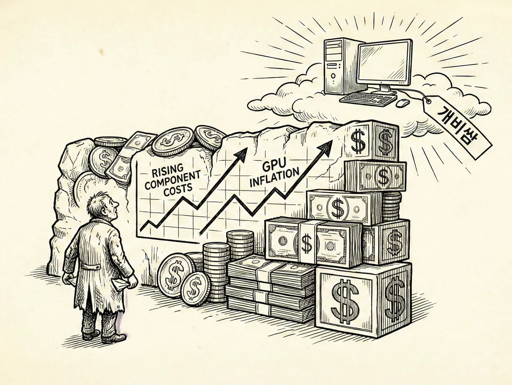

연일 고가를 갱신하고 있는 SSD, RAM의 가격과 아직도 인상이 끝나지 않았다는 신호를 분명히 주고 있는 게이밍 그래픽카드 시장의 상황은 어쩌면 우리가 마주한 적 없는 최초의 재앙과도 같은 사태라고 할 수 있을 것이다.

내가 컴퓨터에 관심을 두기 시작한 계기가 ‘나도 배그 하고 싶은데!’였으니, 이 취미를 가진 지도 이제 겨우 10년 남짓이다. 

업계에 발을 담가본 적도 없고, 용산에서 일해본 적도 없다. 철저한 소비자이자 외부인이다. 

그렇다고 게임 업계를 안다고 말할 수도 없다.

그럼에도 불구하고, 이상할 정도로 선명하게 느껴지는 감각이 있다.
 이번에는 조금 다르다는 느낌.

훌륭한 게임의 등장과 컴퓨터 시장의 호황은 분명 연관이 있다. 적어도 내가 아는 한 그래왔다.

배그가 등장하고 사람들의 그래픽카드는 1060 이상으로 올라갔고,
 옵치가 등장하고 모니터는 144hz가 당연한 선택지가 됐다.
 누군가는 특정 게임 하나 때문에 통째로 본체를 갈아엎었다.

‘이 게임은 해봐야지’라는 말 한마디가 수십만 원짜리 지출을 설득하던 시절이었다.

좋은 게임은 늘 평균 사양을 끌어올렸다.
 그리고 그렇게 올라간 사양은 또 다른 게임들을 느슨하게 만들었다.

조금 덜 최적화돼도 괜찮았다.
 그래픽이 조금 무겁더라도 대충 돌아갔다.
 소위 말하는 발적화 게임들조차 ‘요즘 컴이면 되겠지’ 하고 넘어갈 수 있었다.

컴퓨터가 넉넉했기 때문이다.

문제는 그 ‘넉넉함’이 사라지고 있다는 점이다.

예전에는 100만 원이면 그럭저럭 모든 게임을 무난하게 돌릴 수 있는 본체가 나왔다.
 이제는 소위 ‘메 던 피 롤’ 정도를 쾌적하게 돌리는 견적이 150만 원을 훌쩍 넘는다.
 그래픽카드 하나가 콘솔 한 대 값이다.

취미 치고는 부담이 너무 크다.

신규 유저 입장에서 이 금액은 ‘업그레이드’가 아니라 ‘진입장벽’에 가깝다.
 굳이 이 돈을 들여야 하나, 라는 질문이 먼저 나온다.

그리고 그 질문에 반드시 ‘그래도 해야지’라고 답해 줄 게임이 예전만큼 많지도 않다.

여기서부터는 하드웨어 문제가 아니라 구조의 문제가 된다.

유저가 줄어들면 가장 먼저 흔들리는 건 개발사다.
 대작 하나를 만드는 데 수년이 걸리고, 수백억이 들어간다.

예전에는 ‘어차피 많이 팔린다’는 전제가 있었다.
 컴퓨터는 계속 보급됐고, 신작은 자연스럽게 더 많은 사람에게 도달했다.

지금은 그 공식이 성립하지 않는다.

돌아갈 컴퓨터가 없으면, 애초에 살 사람도 없다.
 판매량을 예측할 수 없는 시장에서 거대한 프로젝트를 시작하는 일은 거의 도박에 가깝다.

그러면 선택지는 단순해진다.
 검증된 속편, 안전한 리메이크, 모바일 이식, 혹은 개발 취소.

‘컴퓨터를 바꿔서라도 해보고 싶은 게임’이 점점 줄어들 수밖에 없다.

그 순간 사이클이 끊긴다.

좋은 게임이 하드웨어를 팔고,
 팔린 하드웨어가 다시 게임을 키워주던 구조.

그 오래된 선순환이 더 이상 돌아가지 않는다.

그리고 사람들은 어느 순간 깨닫게 될지도 모른다.

게임은 사실 안 해도 되는 취미라는 걸.

꼭 필요해서가 아니라, 할 만해서 했던 거였다는 걸.

어라? 영화관이...떠오르나? 좀 다른가? 아무튼.

그렇게 되면 마지막 출구는 모바일뿐일 것이다.
 스마트폰은 이미 모두가 들고 있으니까.
 추가 비용도, 진입 장벽도 없다.

어쩌면 앞으로의 PC게임 시장은 더 커지는 게 아니라, 더 작아질지도 모르겠다.

산업도 위축되고, 취미도 설득력을 잃는다.
 게임이 재미없어져서가 아니라, 굳이 감수할 이유가 사라져서.

그래서 이번 가격 상승이 단순한 부품값 문제가 아니라
 게임 업계 전반의 체력과, 게임이라는 취미 자체의 기반을 동시에 깎아 먹는 신호처럼 보인다.

 

적어도 내 눈에는 그렇다.

---------------

저도 호들갑인 거 알고 있습니다.

일부러 과장되게 써 봤어요.

실제로 게임은 늘 AAA게임이나 개쩌는 3D게임만 있는것도 아니니까요.

저도 스텔라블레이드만큼 스타듀밸리를 좋아합니다.

근데, 곰곰히 생각해보면 일리는 있지 않나요?

높아진 가격에 비탄력적으로 대응하는 곳은 언제나 '정말 필요한'사람들입니다.

산업현장, 사무실, 혹은 편집이나 작업을 업으로 삼는 프로들이겠죠.

그들이 '높아진 새로운 가격'을 감내하고 그게 시장의 새로운 표준이 되는 순간,

게이머들은 순응보다는 포기, 도피를 선택하게 될 지 모른다는 공포가 여전히 남아있습니다.

제가 컴퓨터 취미를 갖고 얼마 지나지 않아 많은 '일반인'들의 컴퓨터 견적을 내주면서 내린 결론이 있습니다.

진정한 일반인은, 그냥 100만원 조금 넘는 컴퓨터를 사서 별 생각 없이 잘 쓰다가

'이거 느려지고 못쓰겠어' 싶어지는 순간이 오면, 새로운 100만원 짜리 컴퓨터를 다시 사는 사람들이라는 거죠.

그 일반인들이 컴퓨터를 사려면 150 200만원을 내야 하는 세상이 오고 있다고 말하고 있는 겁니다.

이후의 미래는 아무도 모를 일이지만, 전 세계가 몰두하고 있는 AI산업의 발전이 가속화 되는 만큼 빠르게 다가올 거라고 생각합니다.

반대로 AI산업의 발전이 둔화되고 꺾이고 실패하는 세계선은 그 나름대로의 지옥도가 펼쳐지겠죠.
